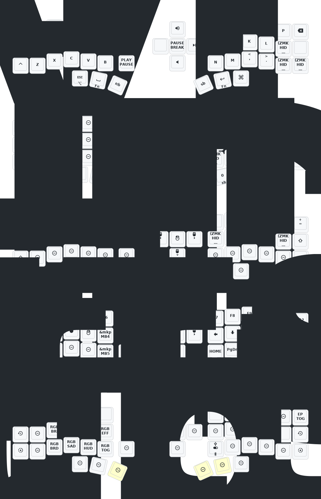

# (Eyelash Peripherals) Corne ZMK Repository

**This keyboard is not the same as [foostan's Corne](https://github.com/foostan/crkbd). It will not work with standard `corne` firmware.**

If you need a 3D model of this keyboard, email `380465425@qq.com`.

## Instructions

1. [Click the **Actions** tab and make sure the workflow is enabled](https://docs.github.com/en/actions/managing-workflow-runs-and-deployments/managing-workflow-runs/disabling-and-enabling-a-workflow#enabling-a-workflow).

## Keymap Diagram

